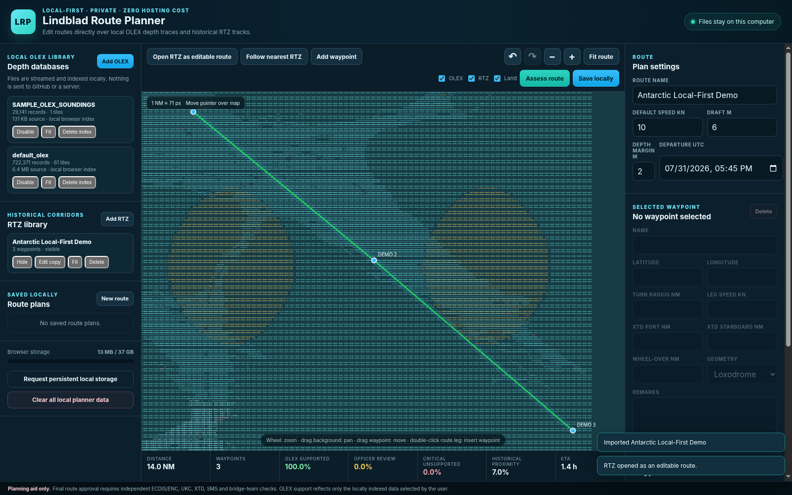

# Lindblad Route Planner Local First 1.0

A static, zero-hosting-cost maritime route-planning web application for GitHub Pages.

## Privacy model

The web host serves only the application files. OLEX databases, RTZ routes and saved route plans are processed and stored by the user's browser on the user's computer. The application contains no upload API, user accounts or central database.

## Main functions

- Select `.olxidx.gz` files or supported gzip sounding exports containing `latitude longitude depth` rows.
- Stream and tile OLEX data into the browser's local Origin Private File System (OPFS).
- Import multiple RTZ routes as historical corridor overlays.
- Open an RTZ route for editing.
- Drag, insert, append and delete waypoints directly in the map.
- Edit waypoint name, latitude, longitude, turn radius, speed, port/starboard XTD, wheel-over distance, geometry and remarks.
- Zoom and pan over local OLEX depth traces with the editable route drawn above them.
- Save route plans locally and export RTZ, JSON and CSV.
- Back up and restore saved routes and RTZ libraries as JSON.
- Cache the application shell for offline use after the first visit.

## Browser requirement

Use a current desktop version of **Google Chrome or Microsoft Edge**. Large OLEX indexing depends on:

- `DecompressionStream`
- IndexedDB
- Origin Private File System through `navigator.storage.getDirectory()`

Safari and Firefox support varies and should not be used for a large operational library without testing.

## Large OLEX databases

There is no application-defined upload ceiling because the file is not uploaded. The practical limit is the browser's storage quota and the free disk space on the user's computer.

Before importing a large database, click **Request persistent local storage**. The browser will create a local geographic tile index. This may require substantial additional disk space and can take a long time for a 50–60 GB compressed file. Keep the tab open during the first index build; gzip indexing cannot reliably resume from the middle after the tab is closed.

The original OLEX source file is never changed. Clearing site data or deleting the local OLEX index removes the browser index, not the source file.

## GitHub Pages deployment

See `DEPLOY_GITHUB_PAGES.md`. No Docker, Caddy, server or local software installation is required.

## Test files

The `samples` folder contains a small RTZ route and a synthetic gzip sounding export. They are for interface testing only and are not navigational data.

## Safety

This is a planning aid and not an approved ECDIS/ECS. Route approval still requires official charts, UKC calculations, XTD checks, the vessel's SMS, bridge-team review and all applicable regulations.
